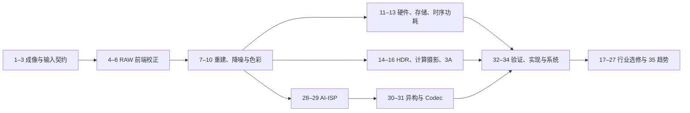

# ISP 课程路线与先修知识

## 先修知识

开始前不要求会 RTL，但应具备：

- Python 基础：能运行脚本、读取报错、理解数组和函数。
- NumPy/OpenCV 基础：能查看 shape、dtype、min/max、直方图和局部 crop。
- 数字图像基础：像素、卷积、采样、RGB、灰度、位深。
- 数学基础：均值/方差、矩阵乘法、对数、简单概率和误差指标。
- 工程习惯：记录命令、环境、输入哈希、配置和输出路径。

如果尚不具备这些能力，先阅读 [`stage1_soft_isp/materials/prerequisites.md`](../stage1_soft_isp/materials/prerequisites.md) 和 [`environment_setup.md`](../stage1_soft_isp/materials/environment_setup.md)。

## 推荐顺序

## 阶段验收

| 阶段 | 章节 | 必做实验 | 通过标准 |
|---|---|---|---|
| A：RAW 基础 | 1–6 | Lab 01–02 | 能检查 RAW 身份、运行 BLC/LSC/DPC 并解释错误现象 |
| B：成像质量 | 7–10 | Lab 03–05 | 能比较 demosaic、denoise、AWB/CCM，不能只报 PSNR |
| C：硬件系统 | 11–16 | Lab 06–07 | 能计算像素率/带宽/缓存，解释 HDR/3A 稳定性 |
| D：方向深化 | 17–31 | Lab 08–11 | 能区分事实和推断，完成 AI 或异构方向实验 |
| E：工程闭环 | 32–35 | Lab 12–13 | 能运行回归、分析质量/延迟/内存并形成证据卡 |

## 学习节奏

- 核心章节：每章 3–6 小时，包括阅读、实验、自测和复盘。
- 行业选修：每章 2–3 小时，重点做证据审计，不要求背产品参数。
- 每完成 4 章做一次回归：重跑已有实验，确认旧结论没有被新改动破坏。
- 所有实验结果应记录到个人学习日志：日期、Git 状态、命令、输入、配置、指标、主观观察和失败案例。

## 不建议的学习方式

- 不先确认 CFA、black/white level 和位深就处理 RAW。
- 只看整图，不看暗部、边缘、纹理、肤色和饱和区 crop。
- 只比较 PSNR/SSIM，不分析色差、时域稳定、延迟和内存。
- 把厂商宣传参数当作可复现 benchmark。
- 读完章节但不运行实验、不保存结果、不做自测。

